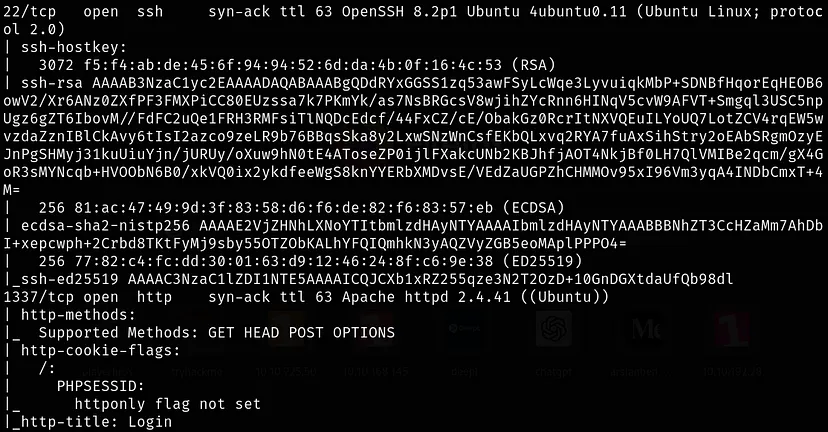
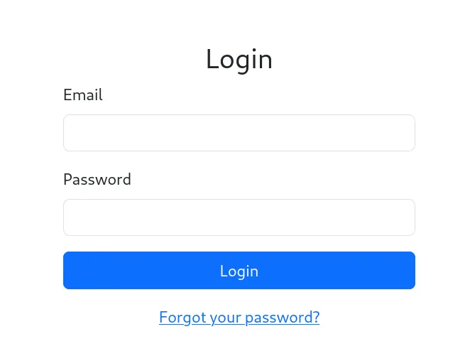

[https://tryhackme.com/r/room/hammer](Hammer) is one of the ‘Medium’ difficulty rooms in THM.

Use your exploitation skills to bypass authentication mechanisms on a website and get RCE.

## NMAP SCAN ##

```
nmap -sS -sC -sV -vvv -p- 10.10.99.113
```



Ports 22-SSH & 1337-HTTP are open.

## RECON ##
I am proceeding to the web page for discovery.

I am greeted by a home page. Not much catches my eye, except for the password reset part. After taking a look at the password reset page, I continue my research.



I understand that I need an e-mail address, I note this tip.


I come across a hint in the source code part, it will be useful to me. I will make a note of this tip.


Wasting no more time, I’m starting a directory scan. There may be something lurking.

```
ffuf -w /usr/share/seclists/Discovery/Web-Content/raft-small-words.txt -u http://10.10.99.113:1337/hmr_FUZZ -s
```


As output:
- images
- js
- css
- logs files, 
I do not forget to add the “hmr_” tag at the beginning of these files by preparing our hint.

I visit the files in turn, looking for something useful.


I’m going through the file and an e-mail address catches my eye. I can use this e-mail address on the password reset screen.


When I proceed to the password reset page and enter the e-mail address, I am asked for a code.

## Recovery CODE

It asks me for a 4-digit code, I will create a file containing all possible combinations.

```
seq 0000 9999 >> rc.txt
```

I create and capture a request for Burp from the page where the recovery code is requested.


We have a limit that decreases with each request. With simple maths, the smallest 4-digit number should be 1000 and the largest number should be 9999. If we can increase our request limit here, we can make all trials and reach the correct result.

> Rate-Limit-Bypass


After my research, I realised that what would work for me is X-Forwarded-For, when I add it to the request, the limit returned in the response is reset.

Before I start the experiment, I need to prepare my command. For this, I take a look at the source code of the reset_password page.

> Apart from the source code, there are many things I need to take notes. I note them all in order.


I seem to have gathered everything I need, finalise my code and do the experiment.
```
ffuf -w rc.txt -u “http://10.10.99.113:1337/reset_password.php” -X “POST” -d “recovery_code=FUZZ&s=60” -H “Cookie: PHPSESSID=<your-value>” -H “X-Forwarded-For: FUZZ” -H “Content-Type: application/x-www-form-urlencoded” -fr “Invalid” -s
```

After entering the mail for the reset process, I run my code and wait, after a few seconds the process is done automatically for me


When it terminates execution, it will be enough to refresh the reset_password page. Now we can type our new password and access the account.


We get the first flag when we access the account.

To understand how the page works, I try a few commands and look at the source code.


I realised I couldn’t use some commands.


When I run the ‘ls’ command, among the files listed, the **“.key”** file catches my eye.


I’m reading the contents of the .key file I mentioned above.


When I take a look at the source code, there’s something here that catches my eye. Now, how to proceed is starting to take shape in my head.

## JWT Token
I go to **JWT.io** to find out what this token contains.


After analysing the output here, I start editing in order.


After editing my role and the path of the **‘kid’** value, I finally place the contents of the “.key” file that I read with **“curl”**.

I make a request to create my own playground on the page and capture it with BURP, then I start experimenting.


When I try with the existing token, I still get an error, it does not allow me to run the command I want, but when I add the token I edited in jwt.io to the ‘Authorization:’ section and make a new attempt, I succeed.


Now all I have to do is get the last flag.

## Conclusion 

I hope I have not made any spelling mistakes or misinformation. Please let me know if you notice any omissions or errors.

For suggestions and questions, you can reach me on LinkedIn.

#tryhackme #writeup